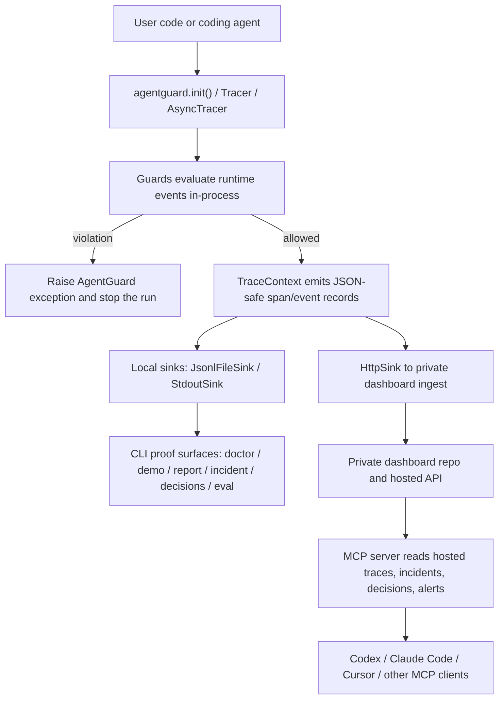

# ARCHITECTURE.md

## 1. System Overview

AgentGuard is the public SDK wedge in the BMD Pat LLC portfolio: a zero-dependency Python runtime-safety SDK plus a small TypeScript MCP server and static public site. This repo exists to make coding-agent safety easy to adopt, easy to trust, and easy to prove locally. The hosted dashboard/control plane is a separate private repo; this repo's job is to ship the free MIT SDK, the MCP bridge, and the public docs/examples that drive distribution.

## 2. Core Principles

- Zero-dependency core SDK stays zero-dependency. Core Python modules under [`sdk/agentguard/`](sdk/agentguard/) must use stdlib only.
- Runtime enforcement beats observability sprawl. The SDK exists to stop loops, retries, timeout overruns, and budget burn while the agent is still running.
- Local-first proof comes before hosted follow-through. `doctor`, `demo`, `quickstart`, starter files, JSONL traces, and local reports must work without API keys or dashboard access.
- Public API stability flows through [`sdk/agentguard/__init__.py`](sdk/agentguard/__init__.py). Internal refactors are fine; user-facing import paths should not drift casually.
- This repo is the public SDK distribution asset, not the private dashboard. If a change primarily belongs to hosted pricing, dashboard UI, policy management, or control-plane behavior, it belongs elsewhere.

## 3. Directory Map

- [`sdk/`](sdk/): Python package source, tests, packaging metadata, and generated PyPI README snapshot.
- [`sdk/agentguard/`](sdk/agentguard/): core SDK modules, CLI helpers, integrations, and sinks.
- [`sdk/tests/`](sdk/tests/): behavioral, structural, hardening, DX, and integration-style tests for the SDK.
- [`mcp-server/`](mcp-server/): published read-only MCP server that exposes AgentGuard traces, decision events, alerts, usage, and cost data through MCP.
- [`examples/`](examples/): runnable local examples, checked-in starter files, notebooks, and proof-oriented onboarding paths.
- [`docs/`](docs/): public guides for getting started, coding-agent onboarding, smoke tests, incident/report flows, and decision/session patterns.
- [`site/`](site/): static public landing/docs pages that describe the public SDK surface only; not the source of truth for private dashboard behavior.
- [`memory/`](memory/): SDK-only ground truth for current state, blockers, decisions, and distribution priorities.
- [`ops/`](ops/): operating docs, north star, roadmap, definition of done, and secondary architecture notes.
- [`scripts/`](scripts/): release guards, preflight logic, generated-readme tooling, and maintenance automation.
- [`proof/`](proof/): saved artifacts that demonstrate local proof for specific PRs or flows.
- [`inbox/`](inbox/): short SDK-only cofounder handoff log after merged PRs.

## 4. Data Flow

## 5. Key Abstractions

- `Tracer` / `AsyncTracer`: the runtime event spine. They create traces, propagate span context, run guards on events, and emit records into sinks.
- `TraceContext` / `AsyncTraceContext`: the scoped unit of work inside a trace. Most runtime instrumentation, decision tracing, and examples build on these.
- Guards: `LoopGuard`, `FuzzyLoopGuard`, `BudgetGuard`, `TimeoutGuard`, `RateLimitGuard`, and `RetryGuard`. Guards raise exceptions instead of returning booleans.
- Sinks: `JsonlFileSink`, `StdoutSink`, `HttpSink`, and `OtelTraceSink`. This is the boundary between runtime evidence and its destination.
- Local proof surfaces: `doctor`, `demo`, `quickstart`, checked-in starters, `report`, `incident`, `decisions`, and `EvalSuite`. These are part of the product, not just internal tooling.

## 6. Boundaries

- This repo does not own the private hosted dashboard UI, billing, team policy controls, or remote control-plane workflows. Those live in `agent47-dashboard`.
- This repo does not become a general agent framework. It instruments and guards agent runtimes that already exist.
- This repo does not optimize prompts, orchestrate workflows, or ship heavyweight eval/observability platforms.
- This repo does not add paid-only features to the SDK. The SDK remains free, MIT, and safe to adopt without hosted commitments.
- This repo should not be the place where dashboard marketing, pricing pages, or speculative hosted-product claims get built.

## 7. Adding New Features

1. Does the change respect zero-dependency core rules and one-way import direction?
2. Is it clearly inside the public SDK/MCP/site boundary, or is it actually dashboard work?
3. Which layer does it belong in: core SDK, optional integration, CLI/proof surface, MCP server, docs/examples, or release tooling?
4. Can it reuse existing patterns like `TraceSink`, guard exceptions, repo-local `.agentguard.json`, or CLI proof flows instead of inventing a parallel path?
5. What proof is required?
   - SDK code: targeted tests plus `sdk_preflight.py`
   - public behavior: runnable example, saved proof artifact, or command output
   - release-facing docs: regenerated [`sdk/PYPI_README.md`](sdk/PYPI_README.md) and sync tests
6. If the change evolves the architecture, update this file in the same PR.

## 8. Known Technical Debt

- Architecture knowledge is currently split between this new root doc and [`ops/02-ARCHITECTURE.md`](ops/02-ARCHITECTURE.md). They are close, but duplication can drift if only one gets updated.
- The public repo still contains [`site/`](site/), which creates recurring boundary confusion because the private dashboard repo also owns hosted product surfaces.
- Some tests still intentionally import private tracing helpers for hardening coverage, so internal refactors need compatibility shims or test cleanup rather than assuming internals are free to disappear.
- The MCP server is a separate package with its own tool/runtime contract, but release and architecture understanding still skews heavily toward the Python SDK.
- Local PR proof is strong, but some supporting repo tooling around GitHub review/check inspection is fragile on Windows shells and depends on manual `gh` fallbacks.

## 9. Change Log

- 2026-04-09: Created root `ARCHITECTURE.md` as the repo-level architecture law for future nightshift and PR work.
