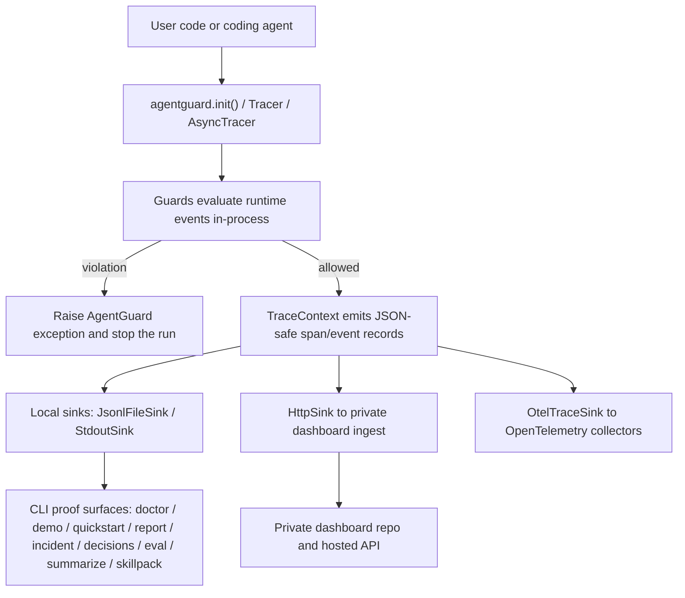
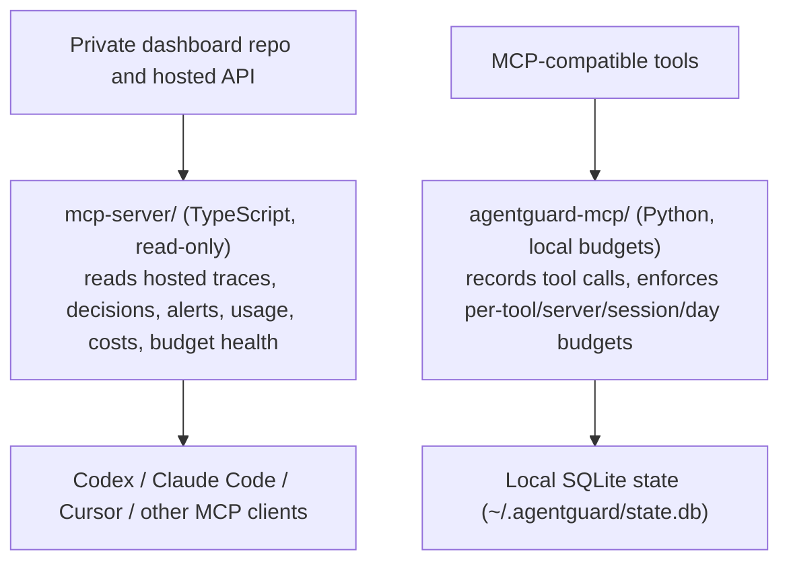

# ARCHITECTURE.md

## 1. System Overview

AgentGuard is the public SDK wedge in the BMD PAT LLC portfolio: a zero-dependency Python runtime-safety SDK (`agentguard47`), two MCP server surfaces, and a static public site. This repo exists to make coding-agent safety easy to adopt, easy to trust, and easy to prove locally. The hosted dashboard/control plane is a separate private repo; this repo's job is to ship the free MIT SDK, the MCP bridges, and the public docs/examples that drive distribution.

## 2. Core Principles

- Zero-dependency core SDK stays zero-dependency. The default/core Python path under [`sdk/agentguard/`](sdk/agentguard/) must not introduce hard runtime dependencies; optional integrations may use guarded optional imports when they are not required for local-first SDK use.
- Runtime enforcement beats observability sprawl. The SDK exists to stop loops, retries, timeout overruns, and budget burn while the agent is still running.
- Local-first proof comes before hosted follow-through. `doctor`, `demo`, `quickstart`, starter files, JSONL traces, and local reports must work without API keys or dashboard access.
- Public API stability flows through [`sdk/agentguard/__init__.py`](sdk/agentguard/__init__.py). Internal refactors are fine; user-facing import paths should not drift casually.
- This repo is the public SDK distribution asset, not the private dashboard. If a change primarily belongs to hosted pricing, dashboard UI, policy management, or control-plane behavior, it belongs elsewhere.

## 3. Directory Map

### Python SDK
- [`sdk/`](sdk/): Python package source, tests, packaging metadata (`pyproject.toml`), the generated PyPI README snapshot ([`sdk/PYPI_README.md`](sdk/PYPI_README.md)), and `sdk/examples/`.
- [`sdk/agentguard/`](sdk/agentguard/): core SDK modules. Highlights:
  - `tracing.py` / `atracing.py`: `Tracer` / `AsyncTracer`, `TraceContext` / `AsyncTraceContext`, plus the core `JsonlFileSink`, `StdoutSink`, and `TraceSink` base.
  - `guards.py`: the guard family and their exceptions.
  - `setup.py`: `init()` / `get_tracer()` / `get_budget_guard()` / `shutdown()` convenience entrypoints.
  - `instrument.py`, `decision.py`, `evaluation.py`, `cost.py`, `usage.py`, `savings.py`, `escalation.py`, `schemas.py`, `profiles.py`, `repo_config.py`, `reporting.py`, `export.py`: instrumentation, decision tracing, eval, cost/usage accounting, and report surfaces.
  - `cli.py`, `doctor.py`, `demo.py`, `quickstart.py`, `skillpack.py`: the CLI and local proof surfaces.
  - [`sdk/agentguard/integrations/`](sdk/agentguard/integrations/): optional, guarded-import framework adapters (`crewai.py`, `langchain.py`, `langgraph.py`).
  - [`sdk/agentguard/sinks/`](sdk/agentguard/sinks/): non-core sinks (`http.py` -> `HttpSink`, `otel.py` -> `OtelTraceSink`).
- [`sdk/tests/`](sdk/tests/): behavioral, structural, hardening, DX, and integration-style tests for the SDK.

### MCP servers (two distinct surfaces)
- [`mcp-server/`](mcp-server/): the published **read-only** TypeScript MCP server (`@agentguard47/mcp-server`). Exposes AgentGuard traces, decision events, alerts, usage, cost, and budget health from the hosted dashboard to MCP clients.
- [`agentguard-mcp/`](agentguard-mcp/): a newer **local-budget** Python MCP server (`agentguard_mcp`). Lets MCP clients record tool calls and enforce per-tool / per-server / per-session / per-day budgets. State lives in local SQLite (`~/.agentguard/state.db`); no account, no telemetry unless `AGENTGUARD_SYNC_URL` is opted into. Modules: `server.py`, `storage.py`, `sync.py`, `__main__.py`. It is developed from this repository checkout and is not published to PyPI/npm.

### Distribution, docs, and tooling
- [`skills/`](skills/): distributable agent skill packs. `skills/agentguard/SKILL.md` is the AgentGuard skill, also surfaced through the SDK `skillpack` CLI command.
- [`examples/`](examples/): runnable local examples, checked-in starter files, notebooks, and proof-oriented onboarding paths (plus `examples/agentguard-mcp/`).
- [`docs/`](docs/): public guides, integration docs, cookbooks, incident/report flows, and community/launch material.
- [`site/`](site/): static public landing/docs pages describing the public SDK surface only; not the source of truth for private dashboard behavior.
- [`memory/`](memory/): SDK-only ground truth for current state, blockers, decisions, and distribution priorities. Per `CLAUDE.md`, `memory/` wins over older repo docs on conflict.
- [`ops/`](ops/): operating docs — north star, SDK scope, roadmap, definition of done, and a secondary architecture note (`ops/02-ARCHITECTURE.md`).
- [`scripts/`](scripts/): release guards, preflight logic, generated-readme tooling, and maintenance automation.
- [`proof/`](proof/): saved artifacts that demonstrate local proof for specific PRs or flows.
- [`inbox/`](inbox/): short SDK-only cofounder handoff log appended after merged PRs.

## 4. Data Flow

### Runtime SDK path (`agentguard47`)

### MCP surfaces

The two MCP servers are independent: `mcp-server/` is a read-only window onto hosted data; `agentguard-mcp/` is a local-first enforcement server with no hosted dependency.

## 5. Key Abstractions

- `Tracer` / `AsyncTracer`: the runtime event spine. They create traces, propagate span context, run guards on events, and emit records into sinks.
- `TraceContext` / `AsyncTraceContext`: the scoped unit of work inside a trace. Most runtime instrumentation, decision tracing, and examples build on these.
- Guards (`guards.py`): `LoopGuard`, `FuzzyLoopGuard`, `BudgetGuard`, `TimeoutGuard`, `RateLimitGuard`, `RetryGuard`. Guards raise exceptions (`LoopDetected`, `BudgetExceeded`, `BudgetWarning`, `TimeoutExceeded`, `RetryLimitExceeded`, all under `AgentGuardError`) instead of returning booleans.
- Sinks: `JsonlFileSink` and `StdoutSink` (core, in `tracing.py`); `HttpSink` and `OtelTraceSink` (non-core, in `sinks/`). The `TraceSink` base is the boundary between runtime evidence and its destination.
- Local proof surfaces: the `agentguard` CLI subcommands `doctor`, `demo`, `quickstart`, `report`, `incident`, `decisions`, `eval`, `summarize`, and `skillpack`, plus `EvalSuite` and checked-in starters. These are part of the product, not just internal tooling.
- MCP surfaces: the read-only TypeScript `mcp-server/` and the local-budget Python `agentguard-mcp/` are first-class adoption surfaces alongside the SDK.

## 6. Boundaries

- This repo does not own the private hosted dashboard UI, billing, team policy controls, or remote control-plane workflows. Those live in `agent47-dashboard`.
- This repo does not become a general agent framework. It instruments and guards agent runtimes that already exist.
- This repo does not optimize prompts, orchestrate workflows, or ship heavyweight eval/observability platforms.
- This repo does not add paid-only features to the SDK. The SDK remains free, MIT, and safe to adopt without hosted commitments.
- This repo should not be the place where dashboard marketing, pricing pages, or speculative hosted-product claims get built.

## 7. Adding New Features

1. Does the change respect zero-dependency core rules and one-way import direction?
2. Is it clearly inside the public SDK/MCP/site boundary, or is it actually dashboard work?
3. Which layer does it belong in: core SDK, optional integration, sink, CLI/proof surface, the read-only `mcp-server/`, the local `agentguard-mcp/`, docs/examples, skill pack, or release tooling?
4. Can it reuse existing patterns like `TraceSink`, guard exceptions, repo-local `.agentguard.json`, or CLI proof flows instead of inventing a parallel path?
5. What proof is required?
   - SDK code: targeted tests plus `sdk_preflight.py`
   - public behavior: runnable example, saved proof artifact, or command output
   - release-facing docs: regenerated [`sdk/PYPI_README.md`](sdk/PYPI_README.md) and sync tests
6. If the change evolves the architecture, update this file in the same PR.

Release tooling follows the same ordering rule: publish package artifacts first,
then create or verify the public GitHub Release, then run announcement
automation. Announcement jobs must be explicitly dispatchable because release
events created by the workflow token are not a reliable trigger source. Release
notes and announcements must start from the last published GitHub Release, not
the last raw git tag, because a tag can exist for a failed package publish.

## 8. Known Technical Debt

- Architecture knowledge is still split between this root doc and [`ops/02-ARCHITECTURE.md`](ops/02-ARCHITECTURE.md). They can drift if only one gets updated; treat this root doc as the law.
- The public repo still contains [`site/`](site/), which creates recurring boundary confusion because the private dashboard repo also owns hosted product surfaces.
- Two MCP packages now coexist (`mcp-server/` TypeScript read-only, `agentguard-mcp/` Python local-budget). Their naming overlaps and release/distribution story still needs consolidating; `agentguard-mcp` is not yet published.
- Some tests still intentionally import private tracing helpers for hardening coverage, so internal refactors need compatibility shims or test cleanup rather than assuming internals are free to disappear.
- Generated/scratch artifacts (`output/`, root-level `*.jsonl` trace files) accumulate at the repo root and are easy to mistake for first-class modules.
- Local PR proof is strong, but some supporting repo tooling around GitHub review/check inspection is fragile on Windows shells and depends on manual `gh` fallbacks.

## 9. Change Log

- 2026-04-09: Created root `ARCHITECTURE.md` as the repo-level architecture law for future nightshift and PR work.
- 2026-05-17: Refreshed directory map, data flow, and abstractions to match the repo as of 2026-05-17 — added the Python `agentguard-mcp/` local-budget server and `skills/`; documented the two distinct MCP surfaces and the current `sdk/agentguard/` module layout.
