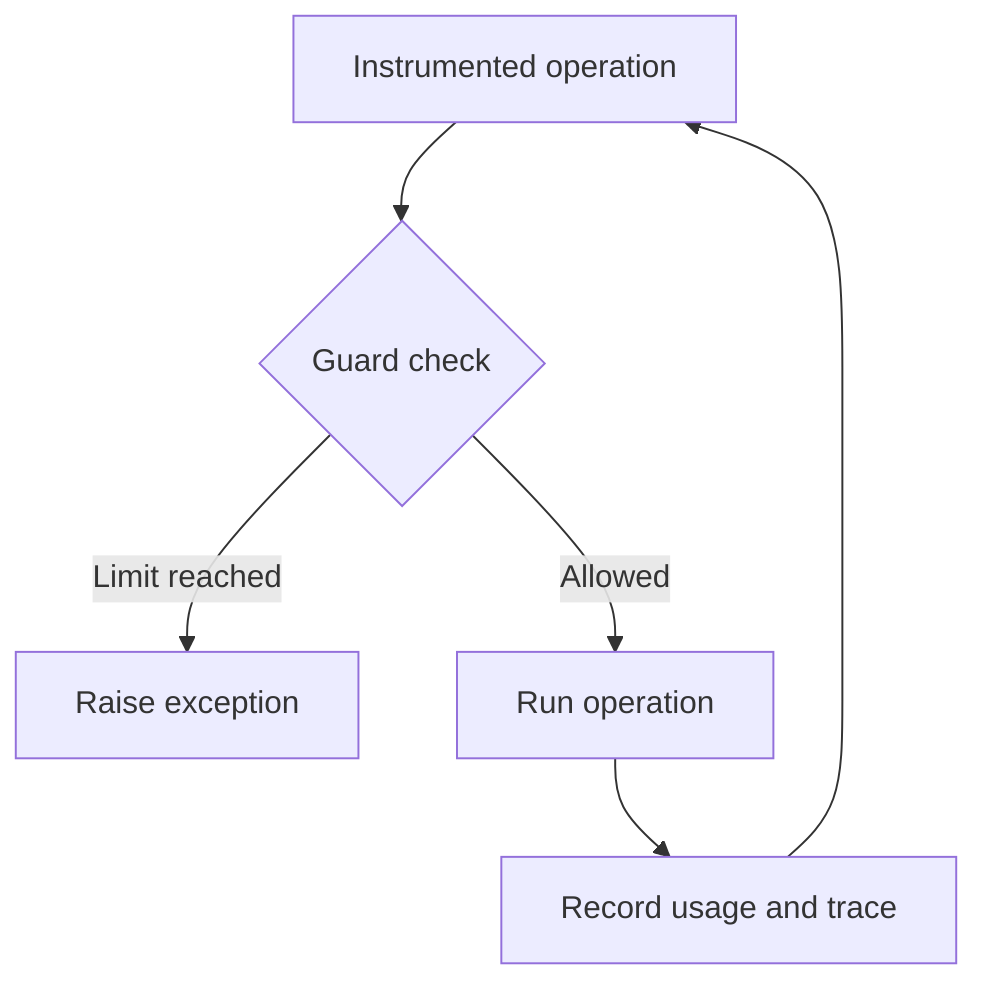

<!-- Generated by scripts/generate_pypi_readme.py. Edit README.md and CHANGELOG.md instead. -->

# AgentGuard

Stop runaway agents with runtime checks in Python.

[](https://pypi.org/project/agentguard47/)
[](https://pypi.org/project/agentguard47/)
[](https://github.com/bmdhodl/agent47/actions/workflows/ci.yml)
[](https://github.com/bmdhodl/agent47/blob/v1.4.1/LICENSE)

AgentGuard checks budgets, repeated tool calls, retries, and elapsed time in
instrumented Python code. Guards raise exceptions so your application can stop
the next operation. The base SDK has no runtime dependencies and needs no account.

**Names:** this repository is `agent47`, the PyPI package is `agentguard47`,
and the Python import is `agentguard`. Requires Python 3.9 or newer.

## Getting started

Install in a virtual environment, then run the offline checks:

```bash
python -m pip install agentguard47
agentguard doctor
agentguard demo
```

`doctor` checks the installation and local trace writing. `demo` exercises
budget, loop, and retry stops without provider keys or network access. Follow
the trace path printed by the command to inspect its output.
`agentguard demo --feedback` prints a local redacted report; nothing is sent.

`agentguard receipt agentguard_demo_traces.jsonl` prints a receipt of each stop
with the trace's SHA-256 drawn as a barcode. Add `--format markdown` to paste it
into a PR or issue. The hash identifies the trace file; it is not a signature.

### Guard a Claude Code session

```bash
agentguard hook claude-code --install --write
```

This installs a Claude Code hook that refuses the third identical tool call in
a row and a call that already failed twice. Refusals go to
`.agentguard/claude-code.jsonl`. It checks tool calls, not tokens or
subscription quota. See the [Claude Code hook guide](https://github.com/bmdhodl/agent47/blob/v1.4.1/docs/guides/claude-code-hook.md).

### Guard a script without editing it

```bash
agentguard run --budget-usd 5 agent.py
```

This patches the OpenAI and Anthropic clients, then runs `agent.py` in the same
interpreter. Settings come from flags, then environment variables, then
`.agentguard.json`. A guard stop exits 1 and prints the trace path for
`agentguard receipt`. `agentguard run python -m mypkg` works too. The bounds are
the same as patching the client yourself; see
[enforcement boundary](https://github.com/bmdhodl/agent47/blob/main/docs/enforcement-boundary.md).

### Stop before a third call

Save this as `budget_demo.py` and run `python budget_demo.py`. It makes no
network requests.

```python
from agentguard import BudgetExceeded, BudgetGuard

budget = BudgetGuard(max_calls=2)
completed = 0

for _ in range(3):
    try:
        budget.check()  # Check before the operation.
        # Put your provider or tool call here.
        completed += 1
        budget.consume(calls=1)  # Record the completed operation.
    except BudgetExceeded:
        print(f"Stopped before call {completed + 1}")

assert completed == 2
```

Expected output: `Stopped before call 3`.

### Connect a provider

Install the provider's client separately. For OpenAI:

```bash
python -m pip install openai
```

```python
from agentguard import BudgetGuard, JsonlFileSink, Tracer, patch_openai

budget = BudgetGuard(max_cost_usd=5.00)
tracer = Tracer(
    service="my-agent",
    sink=JsonlFileSink(".agentguard/traces.jsonl"),
)
patch_openai(tracer, budget_guard=budget)
# Make your OpenAI chat.completions.create calls after this setup.
```

The patch checks recorded usage before dispatch and records response usage
afterward, including streamed calls once the final usage arrives. A response
can exceed the remaining cost or token allowance. Concurrent requests do not
reserve capacity. OpenAI streams request `include_usage` unless the caller
already set it. See the [getting started guide](https://github.com/bmdhodl/agent47/blob/main/docs/guides/getting-started.md)
for setup, traces, and framework starters.

## How enforcement works



Text equivalent: check before an operation, run it if allowed, then record
usage. A guard exception returns control to your application's error handler.

| Guard | Checks | Raises |
| --- | --- | --- |
| `BudgetGuard` | Recorded calls, tokens, or estimated cost | `BudgetExceeded` |
| `LoopGuard` | Repeated tool calls | `LoopDetected` |
| `FuzzyLoopGuard` | Tool frequency and alternating patterns | `LoopDetected` |
| `RetryGuard` | Retries per tool | `RetryLimitExceeded` |
| `TimeoutGuard` | Elapsed time when checked | `TimeoutExceeded` |
| `RateLimitGuard` | Calls within a sliding minute | `BudgetExceeded` |
| `X402SpendGuard` | Payment amounts before the payment callback | `BudgetExceeded` |

For task budgets, use `BudgetGuard.goal(...)`. For signatures and defaults,
read the [guard source](https://github.com/bmdhodl/agent47/blob/v1.4.1/sdk/agentguard/guards.py) and
[public exports](https://github.com/bmdhodl/agent47/blob/v1.4.1/sdk/agentguard/__init__.py).

## Limits and security

- Guards cover operations you instrument. Installing the package does not
  intercept every action in Cursor, Claude Code, or another agent.
- A guard is not a sandbox or permission system. A permitted operation can
  still be destructive.
- Timeout checks do not interrupt an already blocked function or cancel an
  agent running on a provider's server.
- Cost estimates are not invoices. Supply reported cost or use strict cost
  resolution when an estimate is insufficient.
- Recorded-budget preflight refuses the next instrumented call when stored
  usage is already at a cap. It does not reserve concurrent in-flight
  requests, predict the next response, or cap a provider subscription.
  See the [enforcement boundary](https://github.com/bmdhodl/agent47/blob/main/docs/enforcement-boundary.md).
- The base SDK uses the standard library. Optional framework extras install
  third-party dependencies and need their own security review.
- The optional `[crewai]` extra pulls ChromaDB. The
  [2026-09-12 audit](https://github.com/bmdhodl/agent47/blob/v1.4.1/proof/audit-20260912/README.md) found four unresolved
  advisories, including [PYSEC-2026-311 / CVE-2026-45829](https://github.com/advisories/GHSA-f4j7-r4q5-qw2c).
  Review that exposure before installing the extra. Base SDK installs do not
  include ChromaDB.
- Trace content can contain application data. Review it before sharing or
  configuring a remote sink.

See [security reporting](https://github.com/bmdhodl/agent47/blob/v1.4.1/SECURITY.md), the
[dated dependency audit](https://github.com/bmdhodl/agent47/blob/v1.4.1/proof/audit-20260912/README.md), and
[release notes](https://github.com/bmdhodl/agent47/blob/v1.4.1/CHANGELOG.md). Audit results describe their recorded date,
not a permanent clean bill of health.

## Local traces and optional hosted ingest

The SDK is the free local proof path. Start local. Add hosted ingest only
when you need retained history, alerts, team visibility, spend trends,
hosted decision history, or dashboard-managed remote kill signals.

Local guards remain authoritative. `HttpSink` mirrors trace and decision events;
it does not execute remote kill signals by itself. See the
[dashboard contract](https://github.com/bmdhodl/agent47/blob/main/docs/guides/dashboard-contract.md) before configuring it.

Local use has no hosted event quota, retention period, or API-key allocation.
Network egress requires an integration you configure, such as `HttpSink` or
an OpenTelemetry exporter.

Nothing in the local SDK phones home. The
[AgentGuard website](https://bmdpat.com/tools/agentguard?utm_source=agentguard47&utm_medium=readme&utm_campaign=touchpoints)
describes the optional hosted service.

## Documentation

| You want to | Start here |
| --- | --- |
| See which paths actually stop a call | [Enforcement boundary](https://github.com/bmdhodl/agent47/blob/main/docs/enforcement-boundary.md) |
| Install and trace a first run | [Getting started](https://github.com/bmdhodl/agent47/blob/main/docs/guides/getting-started.md) |
| Find guides and source references | [Documentation index](https://github.com/bmdhodl/agent47/blob/v1.4.1/docs/README.md) |
| Try a runnable example | [Examples](https://github.com/bmdhodl/agent47/tree/v1.4.1/examples) |
| Connect LangChain, LangGraph, or CrewAI | [Integration guides](https://github.com/bmdhodl/agent47/tree/v1.4.1/docs/integrations) |
| Inspect hosted data through MCP | [Read-only TypeScript MCP server](https://github.com/bmdhodl/agent47/tree/v1.4.1/mcp-server) |
| Use local budget tools through MCP | [Python budget MCP server](https://github.com/bmdhodl/agent47/tree/v1.4.1/agentguard-mcp) |
| Navigate with an AI assistant | [AI documentation index](https://github.com/bmdhodl/agent47/blob/main/llms.txt) |
| Contribute a fix | [Contributing](https://github.com/bmdhodl/agent47/blob/v1.4.1/CONTRIBUTING.md) |
| Check what changed | [Changelog](https://github.com/bmdhodl/agent47/blob/v1.4.1/CHANGELOG.md) |

## Help and maintenance

Maintained by [Patrick Hughes](https://github.com/bmdhodl).
[Report a bug](https://github.com/bmdhodl/agent47/issues) with the package
version, a minimal reproduction, and the expected result. Report vulnerabilities
through [SECURITY.md](https://github.com/bmdhodl/agent47/blob/v1.4.1/SECURITY.md).

The source metadata defines the branch version. The PyPI badge links to the
published version. Documentation examples and local links are tested in CI.
The PyPI README is generated from this README and the changelog.

[MIT license](https://github.com/bmdhodl/agent47/blob/v1.4.1/LICENSE).

## Latest Release Notes (1.4.1)

### Added
- `agentguard receipt <trace.jsonl>` prints each guard stop, the recorded
  cost, and the trace's SHA-256 as a barcode. `--format markdown` wraps it for
  PRs and issues; `--format json` is for CI. Guard events no longer count
  toward the receipt's cost, so the call that tripped a budget is counted once.

- `agentguard hook claude-code` is a Claude Code hook. It refuses the third
  identical tool call in a row, a call that already failed twice, and, with
  `--max-calls`, calls past a per-session cap. `--install --write` adds it to
  `.claude/settings.local.json` and keeps existing hooks; `--uninstall` removes
  only its own. Refusals are logged for `agentguard receipt`. See
  [the guide](https://github.com/bmdhodl/agent47/blob/v1.4.1/docs/guides/claude-code-hook.md).

- `agentguard run [--budget-usd N] agent.py` runs an unmodified script with the
  OpenAI and Anthropic clients patched. Flags, environment variables, and
  `.agentguard.json` set the limits. A guard stop exits 1 and names the trace
  for `agentguard receipt`.

### Fixes
- `agentguard --version` prints the installed version and exits 0. In 1.4.0
  it exited 2, often on the first command after install.

### Docs
- The PyPI README again states that the optional `[crewai]` extra pulls
  ChromaDB with unresolved advisories, including PYSEC-2026-311 /
  CVE-2026-45829. Base installs do not include ChromaDB.
- CONTRIBUTING shows how to add a provider usage fixture in one session.

### Release checks
- Every stable publish now runs the exact PyPI wheel offline on Windows,
  macOS, and Linux. No SDK runtime behavior changed.
- New [compatibility matrix](https://github.com/bmdhodl/agent47/blob/v1.4.1/docs/compatibility.md). CI now runs the full
  suite against the real OpenAI, Anthropic, LangChain, LangGraph, and
  OpenTelemetry packages at the oldest supported versions and at current
  releases. Missing packages fail the job instead of skipping. CrewAI stays
  experimental (#644); the OpenAI Responses API stays unsupported (AG-06).

Full changelog: [CHANGELOG.md](https://github.com/bmdhodl/agent47/blob/v1.4.1/CHANGELOG.md)
