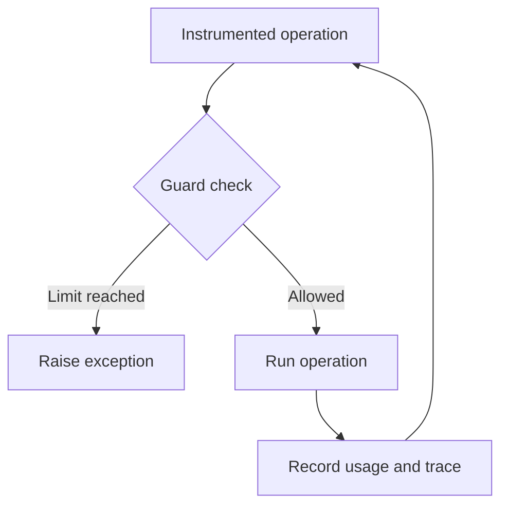

<!-- Generated by scripts/generate_pypi_readme.py. Edit README.md and CHANGELOG.md instead. -->

# AgentGuard

Stop runaway agents with runtime checks in Python.

[](https://pypi.org/project/agentguard47/)
[](https://pypi.org/project/agentguard47/)
[](https://github.com/bmdhodl/agent47/actions/workflows/ci.yml)
[](https://github.com/bmdhodl/agent47/blob/v1.4.0/LICENSE)

AgentGuard checks budgets, repeated tool calls, retries, and elapsed time in
instrumented Python code. Guards raise exceptions so your application can stop
the next operation. The base SDK has no runtime dependencies and needs no account.

**Names:** this repository is `agent47`, the PyPI package is `agentguard47`,
and the Python import is `agentguard`. Requires Python 3.9 or newer.

## Getting started

Install in a virtual environment, then run the offline checks:

```bash
python -m pip install agentguard47
agentguard doctor
agentguard demo
```

`doctor` checks the installation and local trace writing. `demo` exercises
budget, loop, and retry stops without provider keys or network access. Follow
the trace path printed by the command to inspect its output.
`agentguard demo --feedback` prints a local redacted report; nothing is sent.

### Stop before a third call

Save this as `budget_demo.py` and run `python budget_demo.py`. It makes no
network requests.

```python
from agentguard import BudgetExceeded, BudgetGuard

budget = BudgetGuard(max_calls=2)
completed = 0

for _ in range(3):
    try:
        budget.check()  # Check before the operation.
        # Put your provider or tool call here.
        completed += 1
        budget.consume(calls=1)  # Record the completed operation.
    except BudgetExceeded:
        print(f"Stopped before call {completed + 1}")

assert completed == 2
```

Expected output: `Stopped before call 3`.

### Connect a provider

Install the provider's client separately. For OpenAI:

```bash
python -m pip install openai
```

```python
from agentguard import BudgetGuard, JsonlFileSink, Tracer, patch_openai

budget = BudgetGuard(max_cost_usd=5.00)
tracer = Tracer(
    service="my-agent",
    sink=JsonlFileSink(".agentguard/traces.jsonl"),
)
patch_openai(tracer, budget_guard=budget)
# Make your OpenAI chat.completions.create calls after this setup.
```

The patch checks recorded usage before dispatch and records response usage
afterward, including streamed calls once the final usage arrives. A response
can exceed the remaining cost or token allowance. Concurrent requests do not
reserve capacity. OpenAI streams request `include_usage` unless the caller
already set it. See the [getting started guide](https://github.com/bmdhodl/agent47/blob/main/docs/guides/getting-started.md)
for setup, traces, and framework starters.

## How enforcement works



Text equivalent: check before an operation, run it if allowed, then record
usage. A guard exception returns control to your application's error handler.

| Guard | Checks | Raises |
| --- | --- | --- |
| `BudgetGuard` | Recorded calls, tokens, or estimated cost | `BudgetExceeded` |
| `LoopGuard` | Repeated tool calls | `LoopDetected` |
| `FuzzyLoopGuard` | Tool frequency and alternating patterns | `LoopDetected` |
| `RetryGuard` | Retries per tool | `RetryLimitExceeded` |
| `TimeoutGuard` | Elapsed time when checked | `TimeoutExceeded` |
| `RateLimitGuard` | Calls within a sliding minute | `BudgetExceeded` |
| `X402SpendGuard` | Payment amounts before the payment callback | `BudgetExceeded` |

For task budgets, use `BudgetGuard.goal(...)`. For signatures and defaults,
read the [guard source](https://github.com/bmdhodl/agent47/blob/v1.4.0/sdk/agentguard/guards.py) and
[public exports](https://github.com/bmdhodl/agent47/blob/v1.4.0/sdk/agentguard/__init__.py).

## Limits and security

- Guards cover operations you instrument. Installing the package does not
  intercept every action in Cursor, Claude Code, or another agent.
- A guard is not a sandbox or permission system. A permitted operation can
  still be destructive.
- Timeout checks do not interrupt an already blocked function or cancel an
  agent running on a provider's server.
- Cost estimates are not invoices. Supply reported cost or use strict cost
  resolution when an estimate is insufficient.
- Recorded-budget preflight refuses the next instrumented call when stored
  usage is already at a cap. It does not reserve concurrent in-flight
  requests, predict the next response, or cap a provider subscription.
  See the [enforcement boundary](https://github.com/bmdhodl/agent47/blob/main/docs/enforcement-boundary.md).
- The base SDK uses the standard library. Optional framework extras install
  third-party dependencies and need their own security review.
- Trace content can contain application data. Review it before sharing or
  configuring a remote sink.

See [security reporting](https://github.com/bmdhodl/agent47/blob/v1.4.0/SECURITY.md), the
[dated dependency audit](https://github.com/bmdhodl/agent47/blob/v1.4.0/proof/audit-20260912/README.md), and
[release notes](https://github.com/bmdhodl/agent47/blob/v1.4.0/CHANGELOG.md). Audit results describe their recorded date,
not a permanent clean bill of health.

## Local traces and optional hosted ingest

The SDK is the free local proof path. Start local. Add hosted ingest only
when you need retained history, alerts, team visibility, spend trends,
hosted decision history, or dashboard-managed remote kill signals.

Local guards remain authoritative. `HttpSink` mirrors trace and decision events;
it does not execute remote kill signals by itself. See the
[dashboard contract](https://github.com/bmdhodl/agent47/blob/main/docs/guides/dashboard-contract.md) before configuring it.

Local use has no hosted event quota, retention period, or API-key allocation.
Network egress requires an integration you configure, such as `HttpSink` or
an OpenTelemetry exporter.

Nothing in the local SDK phones home. The
[AgentGuard website](https://bmdpat.com/tools/agentguard?utm_source=agentguard47&utm_medium=readme&utm_campaign=touchpoints)
describes the optional hosted service.

## Documentation

| You want to | Start here |
| --- | --- |
| See which paths actually stop a call | [Enforcement boundary](https://github.com/bmdhodl/agent47/blob/main/docs/enforcement-boundary.md) |
| Install and trace a first run | [Getting started](https://github.com/bmdhodl/agent47/blob/main/docs/guides/getting-started.md) |
| Find guides and source references | [Documentation index](https://github.com/bmdhodl/agent47/blob/v1.4.0/docs/README.md) |
| Try a runnable example | [Examples](https://github.com/bmdhodl/agent47/tree/v1.4.0/examples) |
| Connect LangChain, LangGraph, or CrewAI | [Integration guides](https://github.com/bmdhodl/agent47/tree/v1.4.0/docs/integrations) |
| Inspect hosted data through MCP | [Read-only TypeScript MCP server](https://github.com/bmdhodl/agent47/tree/v1.4.0/mcp-server) |
| Use local budget tools through MCP | [Python budget MCP server](https://github.com/bmdhodl/agent47/tree/v1.4.0/agentguard-mcp) |
| Navigate with an AI assistant | [AI documentation index](https://github.com/bmdhodl/agent47/blob/main/llms.txt) |
| Contribute a fix | [Contributing](https://github.com/bmdhodl/agent47/blob/v1.4.0/CONTRIBUTING.md) |
| Check what changed | [Changelog](https://github.com/bmdhodl/agent47/blob/v1.4.0/CHANGELOG.md) |

## Help and maintenance

Maintained by [Patrick Hughes](https://github.com/bmdhodl).
[Report a bug](https://github.com/bmdhodl/agent47/issues) with the package
version, a minimal reproduction, and the expected result. Report vulnerabilities
through [SECURITY.md](https://github.com/bmdhodl/agent47/blob/v1.4.0/SECURITY.md).

The source metadata defines the branch version. The PyPI badge links to the
published version. Documentation examples and local links are tested in CI.
The PyPI README is generated from this README and the changelog.

[MIT license](https://github.com/bmdhodl/agent47/blob/v1.4.0/LICENSE).

## Latest Release Notes (1.4.0)

### Stream reservation (AG-05)
- Store-backed OpenAI and Anthropic streams reserve one call before send.
  Final usage commits once. A dropped connection, a provider timeout, or a
  stream that stops early keeps the hold, including after a partial usage
  chunk. Missing usage under a token or dollar cap stays unresolved
  instead of an authoritative zero. A calls-only cap settles one call.
- Unknown model cost is an overestimate. Dated model ids use the owned alias
  map. Cache and reasoning tokens follow the owned price table. Pass
  `prices=` to `resolve_billable_cost` to override that table. No new public
  export.
- In-memory streams, async non-stream calls, and Anthropic non-stream calls
  stay on recorded-budget preflight. Not an invoice cap.

### One local reservation path (AG-04)
- Sync, non-streaming OpenAI Chat Completions now reserve before send when
  `BudgetGuard` has a `StateStore`. One shared key and one remaining call
  produce one dispatch. Commit records provider usage. Cancel frees the hold
  only if the request never left. Timeout, crash, and unknown outcomes keep
  the hold.
- `BudgetGuard.reservation_totals()` reports settled, reserved, and
  unresolved amounts. `check()` and `consume()` are unchanged.
  This slice left streaming, async, and Anthropic on recorded-budget
  preflight. Store-backed streams are the AG-05 note above.
- This is not an invoice cap. Token and dollar holds need `max_tokens` on
  the request. The dollar bound is the owned high-water estimate.

### Local reservation contract (AG-03)
- Designed reserve / commit / cancel / unresolved semantics for a future
  local `StateStore` path:
  [docs/guides/reservation-contract.md](docs/guides/reservation-contract.md).
- Executable private model: `sdk/agentguard/_reservation_contract.py`.
  Unknown provider outcomes cannot silently free funds. No public type.
  `BudgetGuard.check()` still does not reserve. AG-04 wires one OpenAI path.

### Activation evidence (AG-02)
- Landing-page navigation never counts as install or activation.
- `agentguard demo --feedback` prints a local redacted report (`version`,
  `adapter`, `result`, `reproduction`). Users inspect, `--omit`, or decline.
  The demo still makes no network call.
- Weekly classifier: `python scripts/activation_weekly_report.py
  docs/guides/activation-baseline-2026-09-18.json`.
- bmdpat `install_intent` follow-up:
  [docs/guides/bmdpat-measurement-contract.md](docs/guides/bmdpat-measurement-contract.md).

### Honest enforcement boundary (AG-01)
- Published the tested surface map in
  [docs/enforcement-boundary.md](docs/enforcement-boundary.md): advisory,
  recorded-budget preflight, recorded-event preflight, reservation-backed,
  or unsupported.
- Replaced absolute bill-prevention copy with recorded-budget bounds.
  Direct SDK bypass, in-flight spend, missing usage, concurrent overshoot,
  and provider subscription quotas stay documented as remaining exposure.
- Offline reproductions:
  `examples/enforcement_boundary/exhausted_budget_blocks_dispatch.py` and
  `examples/enforcement_boundary/two_worker_overshoot.py`.

Full changelog: [CHANGELOG.md](https://github.com/bmdhodl/agent47/blob/v1.4.0/CHANGELOG.md)
